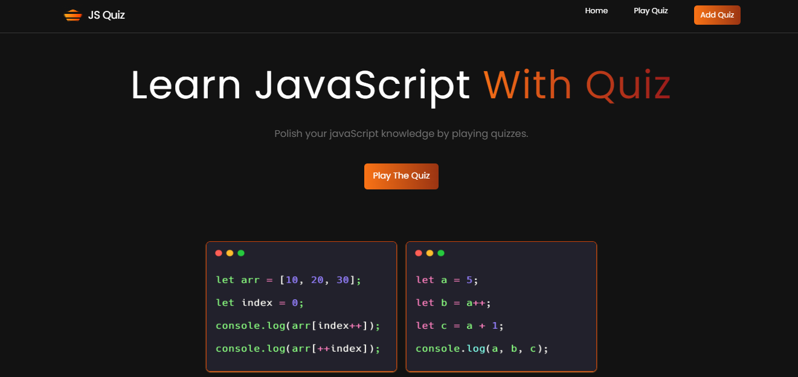

# Quiz App Website

Welcome to javascript Quiz.

## Project



## Project Overview

This project is a quiz website where users can test their knowledge with quizzes on JavaScript output-based questions and web development topics. Users are required to guess the correct answers from multiple-choice options. The application leverages MongoDB for storing quiz data, React for the frontend, and Express with Node.js for the backend.

## Features
- User-friendly interface for taking quizzes
- Multiple-choice questions on JavaScript and web development
- Real-time feedback on user answers
- Dynamic quiz content fetched from a MongoDB database
- Secure and scalable backend using Express and Node.js

## Technologies Used

- Frontend: React with tailwind css
- Backend: Express, Node.js
- Database: MongoDB

## Getting Started
### Prerequisites

- Node.js and npm installed on your machine
- MongoDB installed and running

### Installation
1. Clone the repository:
    ```bash
    git clone https://github.com/imadityaxd/jsuqiz.git
    ```
2. Navigate to the project directory:
    ```bash
    cd jsuqiz
    ```
3. Install backend dependencies:
    ```bash
    cd server
    npm install
    ```
4. Install frontend dependencies:
    ```bash
    cd ../frontend
    npm install
    ```

### Running the Application
1. Start the MongoDB server if it's not already running:
    ```bash
    mongod
    ```
2. Start the backend server:
    ```bash
    cd backend
    npm run dev
    ```
3. Start the frontend development server:
    ```bash
    cd ../frontend
    npm run dev
    ```
4. Open your browser and navigate to `http://localhost:3000` to see the application in action.

## Usage
- Open the application in your browser.
- Browse through the available quizzes.
- Select a quiz and start answering the questions.
- Submit your answers to get immediate feedback on your performance.

## Contributing
Contributions are welcome! Please follow these steps:

1. Fork the repository.
2. Create a new branch for your feature or bug fix:
    ```bash
    git checkout -b feature/your-feature-name
    ```
3. Commit your changes:
    ```bash
    git commit -m 'Add some feature'
    ```
4. Push to the branch:
    ```bash
    git push origin feature/your-feature-name
    ```
5. Open a pull request on GitHub.

## License
This project is licensed under the MIT License - see the [LICENSE](LICENSE) file for details.

## Contact
For any inquiries or feedback, please reach out to:
- **Email:** ravishbisht86@gmail.com
- **GitHub:** [cykoravish](https://github.com/cykoravish)

---

Thank you for checking out the Quiz Website project! We hope you find it useful and educational. Happy quizzing!